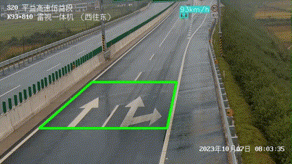
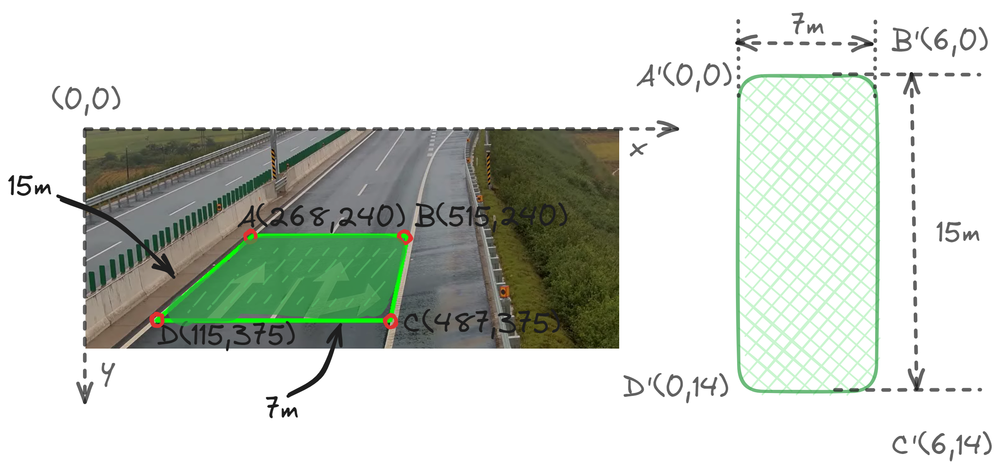

# YOLOV8-Vehicle-Speed-Estimation


# Usage
- python == 3.10
- pytorch == 2.1
- ultralytics == 8.1.8
```
pip install -r requirements.txt
python main.py
```

# Vehicle Detection
Using the [YOLOv8 model](https://docs.ultralytics.com/) to detect and track vehicle from the video.

# Speed Estimation
To calculate the speed, it is used the equation `V = D / T`, where `V` is speed, `D` is distance and `T` is time. However, how to calculate them if we only have a video?

## Distance
In a camera view, even when the car moves at a consistent speed, the pixel distance it covers varies. The further away it is from the camera, the smaller the distance it covers.

In order to eliminate the effects of perspective, we use OpenCV's `getPerspectiveTransform` function to compute the transformation matrix.

Analyzing a single video frame, I chose a stretch of road that would serve as the source region of interest. According to [GB5768.3](https://openstd.samr.gov.cn/bzgk/gb/newGbInfo?hcno=DC7BD0612CD48B8B3C81DD3EFCEA18D7), each white dotted line is **6 meters** long, with **9 meters** between dotted lines. I draw a image as follow:



Finally, we reorganize the coordinates of vertices A-B-C-D and A'-B'-C'-D' into 2D SOURCE and TARGET matrices, respectively, where each row of the matrix contains the coordinates of one point. With these two matrix, we can calculate the real-distance as follow:

```
SOURCE = np.array([
    [1252, 787], 
    [2298, 803], 
    [5039, 2159], 
    [-550, 2159]
])

TARGET = np.array([
    [0, 0],
    [24, 0],
    [24, 249],
    [0, 249],
])


class ViewTransformer:
    """A Class to transform camera view to real-world distance."""

    def __init__(self, source: np.ndarray, target: np.ndarray) -> None:
        """Initialize class with source array and target array."""
        source = source.astype(np.float32)
        target = target.astype(np.float32)
        self.m = cv2.getPerspectiveTransform(source, target)

    def transform_points(self, points: tuple) -> tuple:
        """transform source point to target point and return a tuple (x,y)"""
        x, y = points
        reshaped_points = np.array([[x, y]], dtype=np.float32).reshape(-1, 1, 2)
        transformed_points = cv2.perspectiveTransform(reshaped_points, self.m)
        return (transformed_points[0][0][0], transformed_points[0][0][1])

view_transformer = ViewTransformer(source=SOURCE, target=TARGET)
```

## Time
Simply calculate the distance traveled between two video frames and divide it by the inverse of our FPS, in this case, 1/30.

# Reference
[Piotr Skalski](https://blog.roboflow.com/author/skalskip/). (Jan 19, 2024). How to Estimate Speed with Computer Vision. Roboflow Blog: /estimate-speed-computer-vision/
